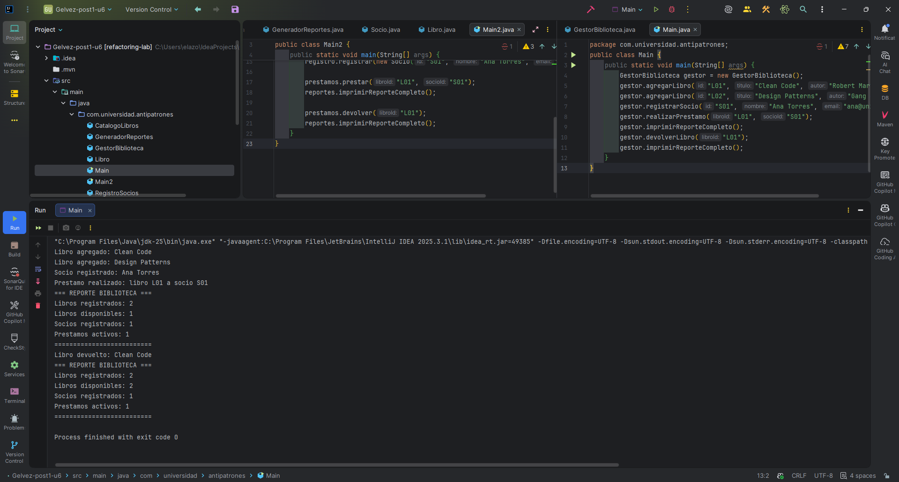
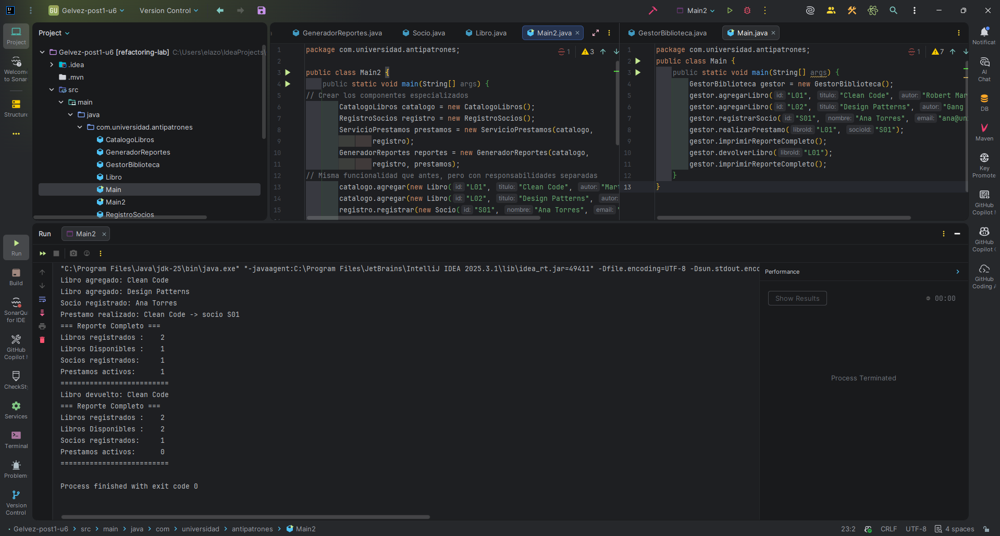

# Refactorizacion de Gestor de Biblioteca aplicando SRP

## Descripcion del antipatron identificado

En la version inicial del sistema se identifica el antipatron **God Object** en la clase `GestorBiblioteca`.

Este antipatron aparece cuando una sola clase concentra demasiadas responsabilidades, por ejemplo:
- administrar el catalogo de libros,
- gestionar socios,
- procesar prestamos y devoluciones,
- y generar reportes.

Como consecuencia, el codigo se vuelve mas dificil de mantener, extender y probar, porque cambios en una responsabilidad pueden impactar en las demas.

---

## Responsabilidades identificadas

Durante el analisis se separaron 4 responsabilidades principales:

### Responsabilidad 1: Gestion del catalogo de libros
Incluye operaciones de:
- agregar libros,
- buscar libros,
- listar libros.

Clase asociada en la refactorizacion: `CatalogoLibros`.

### Responsabilidad 2: Gestion de socios
Incluye operaciones de:
- registrar socios,
- validar socios,
- buscar socios.

Clase asociada en la refactorizacion: `RegistroSocios`.

### Responsabilidad 3: Gestion de prestamos
Incluye operaciones de:
- prestar libros,
- devolver libros.

Clase asociada en la refactorizacion: `ServicioPrestamos`.

### Responsabilidad 4: Generacion de reportes del sistema
Incluye la consolidacion e impresion de informacion del estado del sistema.

Clase asociada en la refactorizacion: `GeneradorReportes`.

---

## Patron de diseno aplicado: SRP

Se aplico el principio **SRP (Single Responsibility Principle)**, que establece que una clase debe tener una unica razon de cambio.

Con esta refactorizacion:
- cada clase tiene una responsabilidad clara,
- se reduce el acoplamiento,
- mejora la legibilidad del codigo,
- facilita pruebas unitarias y mantenimiento evolutivo.

Comparacion de ejecuciones:
- Antes (God Object): flujo centralizado en `Main` y `GestorBiblioteca`.
- Despues (SRP): flujo orquestado en `Main2` con componentes especializados (`CatalogoLibros`, `RegistroSocios`, `ServicioPrestamos`, `GeneradorReportes`).

---

## Capturas de ejecucion

### Antes de la refactorizacion (God Object)

### Despues de la refactorizacion (SRP)

